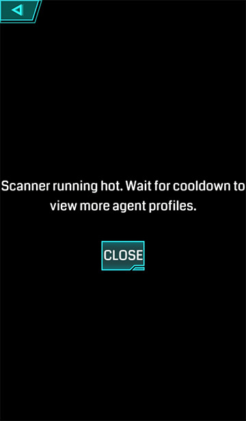
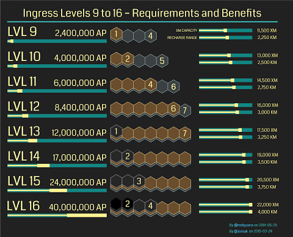
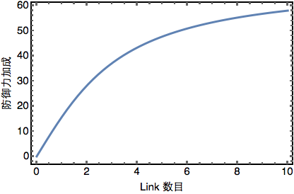
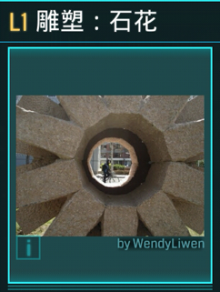
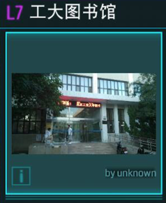
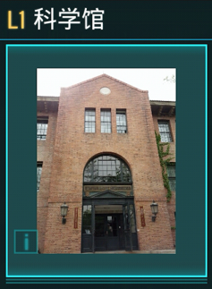
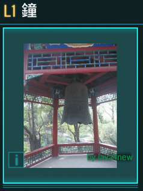

## Ingress 进阶指南

### 写在前面
这是一份进阶的新手入门指南. 如果您第一次进行游戏, 请先通过游戏内置的教程以及阅读 Google 官方的新手入门教程学习基本概念与基本操作: 
https://support.google.com/ingress/?hl=zh-Hans
https://support.google.com/ingress/answer/6169948 

### 服务条款与社区准则
在进行游戏之前, 了解服务条款(Term of Service)和社区准则(Community Guidelines)是极为重要的. 
Ingress 服务条款原文: https://www.ingress.com/terms
Ingress 社区准则原文: https://support.google.com/ingress/answer/2808360?hl=zh-Hans
强烈建议所有玩家在游戏前均仔细阅读此守则.

此处只强调两点:
- 作弊.
    > 虽然欺诈者只能想像出有限的欺诈手段，但至少包括以下方式：使用修改过的或非官方的软件；使用多个帐户玩游戏（每个玩家仅可使用一个帐户）；共享帐户；交易作弊；借助工具或技术来更改或伪造你的位置；出售或交易帐户。

    - 请务必从 Google Play (Android) 或者 App Store (iOS) 上获得游戏. 曾经有很多使用第三方市场上的 Ingress 从而被封号的案例. 
    - 请务必保持一人一帐号. 任何小号, 包括仓库号, 都是被禁止的.
    - 原则上, 官方不限制一号多机. 但以一号多机的形式与其他玩家分享账号是被禁止的.
    - 请不要伪造地点(俗称"飞机"). 有一类不可避免的情况是定位出现漂移(在室内经常出现). 定位出现漂移时, **请不要进行任何操作.** 请重启游戏或等待定位恢复正常后再进行操作. 

- 与用户和旁观者联系.
    >玩游戏时与他人发生不该有的身体接触？偷拍其他玩家或旁观者或偷偷录制相关视频？侮辱其他玩家或旁观者或言语污秽？你在开玩笑吗？千万别那样做。如果有人争强好斗、恶意挑衅、冒犯无礼、刻意保护某个特定Portal或激怒了你，请不予理睬，也不要参与其中。出现这种情况时，请暂时回避或在Comm中屏蔽他们。

    Google 充分保护 Ingress 玩家的隐私. 玩家没有任何义务响应其他玩家的要求: 比如要求在 Comm 中回复消息以自证不是飞机, 或者露面以自证不是飞机. 当遇到此类无理请求, 可直接无视不必响应. 玩家不必担心对方举报. 在没有确切的证据时, Google 不会封禁玩家账号.

    >如果你怀疑有人存在欺诈行为，请勿在Comm中大喊他们的名字或要求他们露出本人的真面目，你只需通过帮助中心举报该行为即可，然后继续专注于自己的任务。

    类似地, 当怀疑对方有作弊行为时, 请直接举报. **不要在公频中@对方或者要求对方露面.** 
    请在这个网页举报作弊行为: https://support.google.com/ingress/#topic=3261401&contact=1&ts=3453649. 举报时务必提交证据(Ingress 游戏截图或 Intel Map 截图). 

此外还需要注意, 游戏鼓励玩家步行. 当运动速度超过约 40km/h 时, 将会受到游戏的惩罚. 此时无法进行 Recharge, Deploy, 释放 XMP, 提示 Hack acquired no items 等. 唯一可以进行的操作是吸收 XM. 这种情况被称为 semi-ban, 往往过几分钟以后便恢复正常. 如果长时间没有恢复正常, 请通过下面的页面通过邮件申诉: https://support.google.com/ingress/answer/4400939#contact=1&ts=3470799,3470805.

#### 封号
封号可以粗略分成三类: 
- Semi-ban. 即之前所说运动速度过快进行的惩罚. 通常很快恢复正常. 
- Complete-ban. 此时游戏中显示 "Scanner Failed",  Intel Map 中显示 "Account is not activated". 如果其他玩家看该玩家资料, 通常(即没有短时间内大量查看玩家资料)显示"Scanner running hot". 需要注意网络问题有时也会导致游戏中显示 "Scanner Failed". 确认 Complete-ban 需结合上述三个现象. 

- 删号/改名. 游戏中所有属于该玩家的 Resonator 消失. 已申请的 Portal 右下角显示"By AgentXXX". 
  图

### 辅助工具
#### Intel Map
从官方的 Intel Map 上, 可以及时查看到世界上任何一处的游戏信息:
https://www.ingress.com/intel. 善于使用 Intel Map 可以显著提高游戏效率.

访问 Intel Map 需要翻墙.
##### Comm 解析
以下操作会被 Comm 记录:
- 部署/摧毁 Resonator
- 连接/摧毁 Link

但下面这些操作不会被 Comm 记录:
- Hack
- 升级 Resonator
- 部署 Mod

善于利用 Comm 的这一特点有时可以起到迷惑作用.

#### App
Android 系统中有一些十分实用的 App 可以配合 Ingress 游戏使用:
- Integrated Timer for Ingress: 记录并自动提示 Hack 的冷却时间/剩余 Hack 次数/ Burnout 冷却时间等.
    https://play.google.com/store/apps/details?id=com.trigonesoft.iti
- Ingress Helper: 运行 Ingress 时保持屏幕常亮/ GPS 活动. 可辅助用于 Trekker 成就的取得.
    https://play.google.com/store/apps/details?id=de.nphardy.ingresshelper
- Ingress Portal Calc:  可以计算一系列与 Portal 有关的参数, 如最长 Link 距离等.
    https://play.google.com/store/apps/details?id=com.gombosdev.ingressportalcalc
- Ingress Intel Helper: 适配手机屏幕的移动版 Intel 地图.
    https://play.google.com/store/apps/details?id=com.bb.ingressintel

#### Ingress Stats
一个用于记录和分析个人 Ingress 数据的网站: https://www.agent-stats.com/

### Agent 解析
每位玩家在认证之前只有仓位上限100. 认证之后仓位上限为2000. 这一数字不会随着等级的提高而增加. 

| 等级     |  升级所需 AP |   XM 上限  | Recharge 距离上限 |
| :--------: | :--------:| :------: | :------: |
| L 1    |   0 AP | 3000 XM  | 250 km |
| L 2    |   2,500 AP | 4000 XM  | 500 km |
| L 3    |   20,000 AP | 5000 XM  | 750 km |
| L 4    |   70,000 AP | 6000 XM  | 1000 km |
| L 5    |   150,000 AP | 7000 XM  | 1250 km |
| L 6    |   300,000 AP | 8000 XM  | 1500 km |
| L 7    |   600,000 AP | 9000 XM  | 1750 km |
| L 8    |   1,200,000 AP | 10000 XM  | 2000 km |
| L 9    |   2,400,000 AP | 11500 XM  | 2250 km |
| L 10    |   4,000,000 AP | 13000 XM  | 2500 km |
| L 11    |   6,000,000 AP | 14500 XM  | 2750 km |
| L 12    |   8,400,000 AP | 16000 XM  | 3000 km |
| L 13    |   12,000,000 AP | 17500 XM  | 3250 km |
| L 14    |   17,000,000 AP | 19000 XM  | 3500 km |
| L 15    |   24,000,000 AP | 20500 XM  | 3750 km |
| L 16    |   40,000,000 AP | 22000 XM  | 4000 km |

除了 AP 需求之外, L9-L16 还需要额外的成就要求. 高级成就同时计入低级成就(比如一个金牌=一个金牌+一个银牌). 
| 等级     |  银牌|   金牌  | 白金牌 |黑牌 |
| :--------: | :--------:| :------: | :------: |:------: |
| L 9    |  4  | 1  | - | - |
| L 10    |  5  | 2  | - | - |
| L 11    |  6  | 4  | - | - |
| L 12    |  7  | 6  | - | - |
| L 13    |  -  | 7  | 1 | - |
| L 14    |  -  | -  | 2 | - |
| L 15    |  -  | -  | 3 | - |
| L 16    |  -  | -  | 4 | 2 |
升级攻略请参考 升级指南 一节. 

L1-L8 升级带来的好处是最明显的: 升入高级后可以使用更高级的道具. L9-L16 升级带来的好处相比来说没有那么直接. 充电距离上限的提升对于大部分玩家来说意义不大, 但 XM 上限的提升确实很有帮助. 

下图直观地显示了 L9-L16 的需求以及带来的好处: 

#### Recharge
Portal 上的 Resonator 每24小时进行一次 Decay.  Resonator 将会损失 XM 上限 15% 的 XM. 所谓24小时, 是从被占领的一刻算起后24小时: 比如一个 Portal 是当地时间下午三点占领的, 那么当地时间第二天下午三点 Portal 将会 Decay. 事实上, Ingress 中的任何统计均是实时滚动的. 一个满状态的 Portal, 如果不充电不受攻击, 7天会完全 Decay 成中立的状态. 受游戏剧情影响这一速度可能会加快. 曾经有出现过每天 Decay 25% 的情况. 

当 Portal 在 Scanner 距离内, 无需 Portal Key 则可直接进行 Recharge. 如在 Scanner 距离外, 则需 Portal Key. Recharge 效率根据此公式进行计算: $100 - \frac{\text{距离(以 km 为单位)}}{\text{玩家等级}\times 5} $. 效率在 50% 处截止, 即如果 Portal 远离使得效率<50%, 则不可 Recharge. 因此每升一级, 最大距离增加 250 km, 距离上限是 4000 km. 

Recharge 有两种模式, Recharge All (平均分配 XM 至每个 Resonator) 和 Recharge 单个 Resonator. 通常 Recharge All, 在对刷等特殊场景时, 有时需要 Recharge 单个 Resonator. 

每次常规的 Recharge 操作将消耗玩家 1000XM, 实际充入的 XM 将按照效率进行折算. (成就中统计的是哪个?) 充电完成后多余的 XM 将会返回给玩家. 

长按 Recharge All 将可以最多一次性消耗玩家 10000XM 用于 Recharge, 是快速 Recharge 的利器. 

每次 Recharge 操作将得到 10AP (无论长按与否). 

### Portal 解析
一个 Portal 有如下指标: 
- 等级(Level)
Portal 的等级由平均 Resonator 等级决定. 实际显示在 Portal 界面的等级向下取整. 比如一个玩家独自可部署的最高级 Portal, 其平均 Resonator 等级为 ${(8+7+6+6+5+5+4+4)}/{8}=5.625$, 显示为5级. Level 将会影响 Hack 得到道具的等级以及最长 Link 距离. 

- 防御值(Mitigation)
 防御值即是 Portal 受到攻击时, 其上 Resonator 减少的伤害的百分比. 比如一个 Portal 的防御值为80, 那么其上 Resonator 实际受到的伤害为防御值为零时的20%. Portal 默认的防御值是零, 可以通过以下两种方式提升防御值: 
 - 部署 Portal Shield. 请参考 Mod 一节. 
 - Link. 当 Portal 连接有 Link 将会提升防御值. Link 数少时对防御值的提升比较显著. 当 Link 较多时, 增长趋缓.  事实上, Link 对 防御值的提升近似由 $\frac{400}{9}\arctan(\text{Link}数/ e)$ 给出. 

特别地, 
    | Link 数量     |    对防御值的贡献| 
    | :--------: | :--------:| 
    | 1      |   16 |  
    | 2      |   28 | 
    | 3      |   37 | 
    | 4      |   43 |  
    | 5      |   48 |  
由上表可见 2根 Link 的防御效果相当于一个 Common Shield, 3根 Link 的防御效果相当于一个 Rare Shield. 其对于 Portal 防御的提升效果明显. 而且 Link 相比于 Mod 被攻击时没有被去除的几率. 只有当 Portal 上的 Resonator 的数量小于 3 时, 其连接的 Link 才会消失. 

 需要注意的是, 防御值的上限为95, 即当根据上述法则计算得到的防御值大于95时, 防御值将被强行设置成95. 
 
- 最长 Link 距离
 Portal 的最长 Link 距离为 $160\text{m}\times \text{(平均 Resonator 等级)}^4$. 比如之前已计算得到一个玩家独自可部署的最高级 Portal 其平均 Resonator 等级为5.625, 则 Link 距离为 $160\text{m}\times5.625=160.18\text{km}$. 对于同一个城市内的 Link, 这个距离通常已经足够了. 

 部署 Link Amp 可以额外增加这一数值. 请参考 Mod 一节. 
 
- Burnout 前的 Hack 次数
 在 Burnout 之前, 一个 Portal 可以被 Hack 四次. 使用 Multi-Hack 可以额外增加这一数值. 请参考 Mod 一节. 
 
- Hack 间冷却时间
 两次 Hack 之间的冷却时间为 5 分钟.  使用 Heat Sink 可以额外增加这一数值. 请参考 Mod 一节. 
 
- 攻击范围
 当 Hack 或者攻击敌方 Portal 时将会受到 Portal 的攻击. Portal 的攻击范围为 $40\text{m}+(5\times\text{Portal 等级})$. 注意到 Scanner 的半径为 40m, 因此 Hack 时必然会受到攻击. 
 
- 攻击力
  | 等级     |   攻击伤害|   
  | :--------: | :--------:| 
  | L 1    |   75 XM |
  | L 2    |   150 XM |
  | L 3    |   300 XM| 
  | L 4    |   500 XM| 
  | L 5    |   750 XM| 
  | L 6    |   1125 XM| 
  | L 7    |   1625 XM|  
  | L 8    |   2500 XM| 
  
  类似 XMP 对 Resonator 的攻击, Portal 对玩家的攻击也有一定几率发生双倍(Critical Hit). 被 L8 的 Portal 双倍攻击一次就将损失 5000XM, 这还是在不计入 Mod 的情况下!  这也是为什么在高级 Portal 群中使用 XMP 时 XM 损失很快的原因. 具体应对策略请参考 清理塔群 一节. 

 使用 Force Amp 可以额外增加伤害, 使用 Turret 可以额外增加双倍攻击概率. 请参考 Mod 一节. 

- 攻击频率
使用 Turret 可以额外增加 Portal 攻击频率. 请参考 Mod 一节. 

#### Hack
Hack 操作将会消耗 XM. 数量为  $50\text{XM}\times\text{Portal 等级}$. 

如果 Hack 敌方 Portal,  可以得到 100AP, 但还要额外被敌方 Portal 攻击一次. 请参考 Portal 解析 一节. 

Hack 得到的物品等级取决于玩家等级和 Portal 等级. Portal 的有效等级= min(玩家等级,  Portal 等级). Hack 可能得到的 XMP 和 Resonator 的等级为 Portal 的有效等级+2-1, 越高等级的概率越低. 可能得到的 Ultra Strike, Power Cube 的等级为 Portal 的有效等级. 比如一个5级玩家 Hack 一个7级 Portal, 他只可能得到: 4-7级的 Resonator 和 XMP, 5级的 Ultra Strike 和 Power Cube. 

长按 Hack 可以进入 Glyph Game. 此时需要在规定时间内画出规定数目的 Glyph 从而获得更多道具. 
| Portal 的**有效等级**     |   时间上限|  Glyph 数目 |  Glyph 分数 |
| :--------: | :--------:| :--------:| :--------:| 
| L 1    |   22s  |1 |1 |
| L 2    |   21s  |2 |2 |
| L 3    |   20s | 2 |2 |
| L 4    |   19s | 3 |4 |
| L 5    |   18s | 3 |4 |
| L 6    |  17s | 4  |8 |
| L 7    |   16s |  4 |8 |
| L 8    |   15s | 5 | 15 |

除了得到更多道具之外, Glyph Game 还可以得到更多 AP (画对一个 Glyph 有 50AP, 全部画对还有速度加成). 如果**所有 Glyph 都没有画错**, 可以增加 Glyph 分数以得到 Translator 成就. 得到的 Glyph 分数见上表. 

进行 Glyph Game 时有一个技巧: 当Glyph 画错时可以直接点按手机的 Home 键返回桌面. 再次切换进 Ingress 时, 本次 Glyph Game 会中断, 并不计入 Hack. 可以重新再进行一次 Glyph Game. (当然出现的 Glyph 是不一样的. )

所有可能出现的 Glyph 是有限的, 可以参考: http://glyphtionary.com/. 实际出现的 Glyph 组合也是有限的, 往往多是一些有意义的词组或短句. 多加练习, 熟能生巧, 掌握 Glyph Game 并非难事. 

#### Portal 种类
由于历史原因, Ingress 中的 Portal 主要有三类. 通常(在照片没有被替换过的情形下)可以从 Portal 显示的照片中看出. 
- 最久远的 Portal 照片右下角显示的"By #Name#/unknown"是没有颜色的字体.  这些 Portal 来源于早期 NIA (如从 Panoramio 中)自动采集一些网络图片. 
 
 
- 第二类久远的 Portal 照片右下角没有任何提示. 这些 Portal 来源于 Ingress 早期通过邮件提交的 Portal. 

- 最常见的 Portal 照片右下角显示的"By #Agent Name#"是蓝色或绿色的字体. 这些 Portal 来源于玩家的申请. 

### 物品解析
回收一个 n 级的 Res, XMP, US 以及 Powercube 时, 将得到 (20n) XM.

回收一个 Common/Rare/Very Rare 的 Mod 以及病毒时, 将得到 40/80/100 XM.
#### Resonator
| 等级     |   能量|   部署者 XM 消耗  | 每个玩家最多可部署的数量 |
| :--------: | :--------:| :------: | :------: |
| L 1    |   1000 XM |50 XM  | 8 |
| L 2    |   1500 XM |100 XM  |4 |
| L 3    |   2000 XM| 150 XM  |4 |
| L 4    |   2500 XM | 200 XM  |4 |
| L 5    |   3000 XM  | 250 XM  |2 |
| L 6    |   4000 XM	 | 300 XM  |2 |
| L 7    |   5000 XM	 |  350 XM  |1 |
| L 8    |   6000 XM	 |  400 XM  |1 |

注意到部署数量的限制, 一位八级玩家独立部署的 Portal 等级最高为5, 两位玩家为6, 三位八级玩家为 7, 八位玩家为8. 

#### 武器
##### XMP
| 等级     |   伤害范围 |   中心区平均伤害   |   释放者 XM 消耗  |
| :--------: | :--------:| :------: | :------: |
| L 1    |   42 m | 150 XM  | 50 XM  |
| L 2    |   48 m | 270 XM	  | 100 XM  |
| L 3    |   58 m | 470 XM	  | 150 XM  |
| L 4    |   72 m | 740 XM	  |200 XM  |
| L 5    |   90 m  | 990 XM  | 250 XM  |
| L 6    |   112 m	 |  1240 XM	 |300 XM  |
| L 7    |   138 m	 |  1580 XM	 |350 XM  |
| L 8    |   168 m	 |  2050 XM	 |400 XM  |

此外 XMP 造成伤害时有一定几率造成双倍于上表的伤害(critical hit). 造成双倍伤害时会数字旁会显示"!"号.

伤害随距离的衰减快于线性, 粗略看与平方衰减更为相似. 不过这一看法并不准确, 因为 XMP 造成的伤害随距离的变化不是连续的, 而是一个分段函数. (比如对于 L8 的 XMP, 距离每增加约 30m 伤害衰减一次. 详见: http://ipas.graphracer.com/analysis.html )

XMP 的伤害模拟, 可以参考网站: http://ipas.graphracer.com/

关于释放 XMP, 一个重要的技巧是长按 Fire 键可以最多提高20%的伤害, 这粗略相当于提升一个 XMP 伤害等级. **如无特殊情况, 尽量长按 Fire 键释放 XMP.**

Portal 实际受到的伤害的计算还要考虑 Portal 本身的防御. 请参考 Portal 解析一节.

附已有的数据:
- 未经官方确认的逆向工程结果:  https://groups.google.com/forum/#!topic/ingress-discuss/jEnHlKMyl5A

   -  $$\text{XMP 伤害}=(\text{基础值}+\text{在此基础上的随机涨落})\times 0.5^{\frac{5\times \text{距离 Res 的距离}}{\text{XMP 最大伤害范围}}}.$$
其中
    | 等级     |    伤害基础值 |  随机涨落最大值   |
    | :--------: | :--------:| :------: |
    | L 1      |   136 |  180  |
    | L 2      |   226 |  300  |
    | L 3      |   406 |  540  |
    | L 4      |   630 |  840  |
    | L 5      |   900 |  1200  |
    | L 6      |   1260 |  1680  |
    | L 7      |   1800 |  2400  |
    | L 8      |   2700 |  3600  |

   - $$\text{XMP 最大伤害范围}=40+2(\text{XMP 等级})^2$$
    
   - $$\text{双倍伤害的几率}=(\text{XMP 等级})*2\%$$

- 玩家实际实验结果: http://ipas.graphracer.com/analysis.html 与逆向工程结果基本符合.

##### Ultra Strike
| 等级     |   伤害范围 |   最高伤害   |   释放者 XM 消耗  |
| :--------: | :--------:| :------: | :------: |
| L 1    |  10 m | 300 XM  | 50 XM  |
| L 2    |  13 m | 600 XM	  | 100 XM  |
| L 3    |   16 m | 1000 XM	  | 150 XM |
| L 4    |   18 m| 1800 XM	  | 200 XM  |
| L 5    |   21 m | 2400 XM  | 250 XM  |
| L 6    |   24 m	 |  3000 XM	 |300 XM  |
| L 7    |   27 m	 |  3600 XM	 |450 XM  |
| L 8    |   30 m	 |  5400 XM	 |400 XM  |

此外 US 造成伤害时有一定几率造成双倍于上表的伤害(critical hit). 造成双倍伤害时会数字旁会显示"!"号.

与释放 XMP 类似, 也可以通过长按 Fire 键提高最多20%的伤害.

US 的特点是基本伤害高于同等级 XMP, 双倍伤害的几率很高. 但其攻击范围小, 随距离衰减极快. US 最大的用处是在 Portal 中心释放, 可以高效地破除 Portal 上的 Mod. 当 Res 密集在 Portal 中心时, 也可以考虑使用 US.  (这也反向提示在部署 Res 时尽量分散, 不要集中在 Portal 中心. )

##### 病毒
蓝绿病毒可以强行改变 Portal 的所有者. 绿军使用蓝毒, Portal及其上的 Res 和 Mod 的拥有者是 ADA, 蓝军使用绿毒, Portal及其上的 Res 和 Mod 的拥有者是 Javis. 其他情况下拥有者为病毒使用者本人.

病毒本身没有等级, 对使用者也没有直接的等级限制. 但是在 n 级 Portal 上成功使用病毒, 需要 (1000n+1) 的 XM. 而 m 级 ($m\leq8$) 的玩家的 XM 上限是 1000(m+2), 因此 m 级玩家最多可以在 (m+1) 级 Portal 上使用病毒. 比如: 毒掉一个8级 Portal 至少需要一个至少7级的玩家.

病毒虽然强力, 但也并非毫无弱点. 病毒的一个重要特性是被病毒改变阵营的 Portal, 一小时内对任何病毒免疫. 在这一小时的免疫时间内内再次对此 Portal 使用病毒, 无法改变 Portal 阵营且**使用的病毒会消失**. 可以利用此特性提前防御性地使用病毒, 防止对方使用病毒.

病毒在游戏中有广泛的战术应用, 仅受玩家的想象力所限. 下面列举一些常见的应用:
- 强行转变难以攻打的 Portal (大量盾/大量玩家充电/线下防守, 常见于大 Field 顶点等)的阵营. 但此方法可以利用一小时免疫的特性防御.
- 强行建立高级 Portal. 两个不同阵营的玩家配合, 消耗7个病毒就可以建立起8级 Portal; 两个相同阵营的玩家配合, 消耗14个病毒就可以建立起8级 Portal.
- 防守高级 Farm Portal. 对于偏远的高级床 Po/ 工 Po, 当招架不住对方攻势时, 可以使用病毒暂时转变其阵营.
- Anomaly 活动中获得先手优势. 在大陆目前的网络环境下, 防守方的优势大于进攻方. (具体参考对刷一节. ) 因此先手优势极为重要. 在最近的3月28日的广州 Shonin 活动中, 蓝军就采用了提前两小时使用一次病毒(蓝毒), 提前一小时使用一次病毒(绿毒), 活动开始时使用一次病毒(蓝毒)的方式获得先手优势.

#### Mod
每个 Portal 共有4个 Mod 插槽. 每位 Agent 只能在(i)己方 Portal (ii) 插槽有空位 (iii) XM 足够的情形下部署 Mod. 每位 Agent 在同一个Portal上最多部署两个 Mod. Mod 部署后无法直接去除, 因此部署之前应小心谨慎.

Mod 按照稀有程度分为大体分为三级: Common, Rare, Very Rare. 部署这三类 Mod, 分别需要消耗 400 XM, 800 XM, 1000 XM.

- Portal Shield

    | 等级      |    防御值(Mitigation) | 粘度(Stickiness)   |
    | :--------: | :--------:| :------: |
    | Common    |   30 | 0  |
    | Rare    |   40 | 150000  |
    | Very  Rare    |   60 | 450000  |
    | Very  Rare (AXA)    |  70 | 800000  |

    - 防御值即 Portal Shield 减少 Res 受到的伤害的百分比. 这一项数据直接叠加: 比如有两个 C 盾的 Portal 只受到原有伤害的 $100-30\times2=40\%$ 的伤害. 但防御值上限为 95: 比如有两个 VR 盾的 Portal 由于 $60\times 2>95$, 因此受到原有伤害的 5% 的伤害. 除了 Portal Shield 以外, Link 的存在也可以增强 Portal 防御. 请参考 Portal 解析.
    - 尚不清楚粘度数据的作用. 粘度数据最早从 Intel Map 返回的数据中解析获得. 通常认为粘度代表 Portal Shield 不容易被破除的程度. 粘度越大越好.
    - AXA 盾出现在2014年12月15日,  是 AXA 保险赞助的结果. 它可以从任何 Portal 上通过 Hack 得到, 比 VR 盾更为稀有. 从 AXA 保险的 Portal 上 Hack 得到的几率更大. (大陆范围内暂时没有 AXA 保险 Po) https://plus.google.com/wm/1/+Ingress/posts/6E6wBwsNqC6

- Link Amp

    | 等级      |     Portal Range 增益 |
    | :--------: | :--------:|
    | Rare    |   *2|
    | Very Rare    |   *7 |

    - 与 Force Amp 和 Turret 类似, 当部署第二个 Link Amp 时,  效果减为 1/4. 部署第三和第四个 Link Amp 时, 效果减为 1/8. 与部署先后顺序无关, 以最大的算法为准. (总是认为 Very Rare 的 Link Amp 是先部署的. )
        比如一个8级 Portal, 全部部署 R 的 Link Amp, 其 Portal Range 为 $655.36\,\mathrm{km}\times(2+0.5+0.25+0.25)=1966.08\,\mathrm{km}$. 全部部署 VR 的 Link Amp, 其 Portal Range 为 $655.36\,\mathrm{km}\times(7+1.75+0.875+0.875)=6881.28\,\mathrm{km}$. 这也是目前游戏中能进行的最长的 Link.
    - Very Rare 的 Link Amp 无法通过 Hack 取得, 只能通过兑换代码等特殊途径获得.

    Link Amp 通常在大 Field 以及 Artifacts 活动中有用. 平时游戏中不常见.

- Heat Sink
    | 等级      |   冷却时间减少  |
    | :--------: | :--------:|
    | Common    |   20% |
    | Rare    |   50% |
    | Very  Rare    |   70% |
    - 当部署第二, 第三或第四个 Heat Sink 时, 效果减半. (总是认为最稀有的 Heat Sink 是先部署的. )

        比如部署了一个 VR 的 Heat Sink 的 Portal, 其冷却时间为 $5\,\mathrm{min}\times(1-70\%)=1.5\,\mathrm{min}$. 部署了四个 VR 的 Heat Sink 的 Portal, 其冷却时间为 $5\,\mathrm{min}\times(1-0.7)(1-0.35)(1-0.35)(1-0.35)=24\,\mathrm{s}$.

    - 一个没有部署 Multi-hack 的 Portal, 玩家在其 Burnout 之前只能 Hack 四次.  Heat Sink 的一个重要作用是, 对于 Heat Sink 的部署者(无论其等级), 其 Hack 计数在部署后清零. 比如在做 Field 时恰好缺一个 Portal Key, 但目标 Portal 已经 Burnout. 这时可部署一个 C 的 Heat Sink, 便可以立刻 Hack.

- Mult-hack

    | 等级      |   增加额外的 Hack 次数  |
    | :--------: | :--------:|
    | Common    |   4 |
    | Rare    |   8 |
    | Very  Rare    |  12 |

    - 当部署第二, 第三或第四个 Mult-hack 时, 效果减半. (总是认为最稀有的 Mult-hack 是先部署的. )

        比如部署了一个 VR 的 Mult-hack 的 Portal, 在其 Burnout 之前可以 Hack 的次数为 4+12=16次. 部署了四个 VR 的 Mult-hack 的 Portal, 在其 Burnout 之前可以 Hack 的次数为 4+12+6+6+6=34次.

    - 配合好 Mult-hack 与 Heat Sink, 可以最大化 Hack 次数. 一种常见的情形是: 先 Hack 四次一个 Portal 至 Burnout, 部署 R 的 Multi-hack, 可再 Hack 八次至 Burnout. 再部署 Heat Sink, (对于部署者)可再 Hack 十二次至 Burnout. 总共 Hack 次数为4+8+12=24次.

- Force Amp
Force Amp 只有 Rare 一种, 可以使 Portal 攻击敌对阵营玩家时造成的伤害翻倍. 与 Link Amp 类似, 当部署第二个 Force Amp 时,  效果减为 1/4. 部署第三和第四个 Force Amp 时, 效果减为 1/8.

- Turret
Turret 只有 Rare 一种, 可以使 Portal 攻击敌对阵营玩家的频率翻倍, 并增加 30% 双倍攻击的概率. 与 Link Amp 和 Force Amp 类似, 当部署第二个 Force Amp 时,  效果减为 1/4. 部署第三和第四个 Force Amp 时, 效果减为 1/8.

    由于部署相同的 Mod 会造成效果的衰减, 为了最大化 Portal 对敌对阵营玩家的攻击效果, 通常一个 Force Amp 与一个 Turret 是比较经济的.

有关 Mod 的部署策略, 请参考 Mod 部署策略 一节.

#### Power Cube
| 等级     |   补充能量|
| :--------: | :--------:| :
| L 1    |   1000 XM |
| L 2    |   2000 XM |
| L 3    |   3000 XM|
| L 4    |   4000 XM |
| L 5    |   5000 XM  |
| L 6    |   6000 XM	 |
| L 7    |   7000 XM	 |
| L 8    |   8000 XM	 |

#### Capsule
Capsule 可以用来储存物品.
- 在 Capsule 中的物品无法通过任何方式使用. 可以利用这一特性获得额外的 Portal Key, 参考 Portal Key 一节.
- Capsule 可以方便玩家交换道具. 需要注意 Capsule 本身也需要占用一个仓位. 因此为了接收一个装满道具的 Capsule, 玩家需要101个空仓位. 这导致未经认证的玩家无法捡起装满道具的 Capsule. 
- Capsule 中不能储存 Capsule.
- 回收 Capsule 可以获得100XM. 同时 Capsule 中的物品也全部消失, 玩家也将一并获得其中物品的 XM.

#### Portal Key
Portal Key 有两个作用:
- 消耗 Portal Key 建立 Link.
- 保有 Portal Key 进行远程充电. 远程充电距离请参考等级解析一节.

如果你没有所 Hack 的 Portal 的 Portal Key, 那么有大约 75% 的概率 Hack 得到 Portal Key. 但如果你已经拥有所 Hack 的 Portal 的 Portal Key, 那么不会 Hack 得到 Portal Key. 因此为了得到更多 Portal Key, 可以:
- 将 Portal 暂时丢在地上, Hack 完成后再捡回来.
- 将 Portal 放进 Capsule 里.

由于 Capsule 糟糕的排序机制(根据 Unicode 字符集中的顺序), 后者操作起来更为麻烦, 但对于大量 Portal Key 的情形, 两种方法需交替使用.

#### Media
Media 通常指向与游戏剧情或新闻有关的链接. 通常唯一的作用是回收以获得20XM. 但某种程度上说, Media 是不可再生的, 因此也具有一定的收藏价值.

### 游戏技巧
####  升级策略
以下操作可以获得 AP: 
| 操作     |     获得 AP |  
| :--------: | :-------:| 
|Hack 敌方 Portal   |   100 AP | 
|Hack  本方或中立 Portal |   0 AP | 
|Glyph Hack 画对一个图   |   50 AP (全对有速度加成)| 
|充电    |   10 AP | 
|部署一个新的 Res	  |   125 AP   | 
| 升级自己的 Res   |   0 AP | 
|升级其他玩家的 Res  |   65 AP | 
|占领一个中立 Portal    |   500 AP | 
|将一个 Portal 完全部署   |   250 AP | 
| Link 两个 Portal   |   313 AP | 
|建立一个 Control Field|   	1250 AP  | 
|部署一个 Mod    |   125 AP | 
|摧毁一个 Res |   75 AP | 
|摧毁一条 Link    |   187 AP | 
|通过 Portal 申请    |   1000 AP | 
|通过 Portal 照片  |   500 AP | 
|修改 Portal 地点, 名称等信息   |   200 AP | 
|兑换 Passcode   |   50-1500 AP | 

从表中可以看出, Ingress 更加鼓励建设. 在游戏初期, 由于低等级武器威力极为有限(参见 物品解析 一节), 因此低等级玩家升级最快的方式就是建设.  主要说来有两种方式: 
- 寻找附近的中立 Portal, 尽可能在其上部署满 Res. 将一个 Res 部署满可以获得 1750 AP. 
- 尽可能建立 Control Field. 由于建立 Field 获得的 AP 与大小无关, 所以新手升级时尽可能建设更多的 Field. 最大化 Field 数有多重的技巧, 请参考多重的专门教程. 

Ingress 鼓励玩家的线下互动. 一个人升级是很辛苦的. 所以请尽快找到附近的同阵营玩家组织. 在他们的帮助下(提供道具, 清理敌方 Portal), 你的升级肯定会事半功倍! 

####  一些技巧
##### 日常细节
- 在部署 Res 时, 玩家距离 Portal 中心的距离就是所部署的 Res 距离 Portal 中心的距离. 根据 XMP 一节的介绍, XMP 的效果随着距离衰减. 因此部署 Res 时尽可能远离 Portal 中心. (Scanner 的半径是40m, 也是 Res 距离 Po 心可能的最远距离. 注意到 L8 XMP 的最高伤害半径为30m, 这意味着远离Portal部署 Res 是有效的. ) 在部署 Res 时, 通过点击插槽还可以选择 Res 部署的位置(有红点的插槽意味着正北). 通常将高级 Res 部署在距离玩家最远的方向(比如河边的 Portal 将 Res 部署在河中心的位置), 可以尽可能多消耗对方 XMP. 如果没有特别的位置, 尽可能将高级 Res 对角线部署. 
- 部署 Shield 时,  通常至少部署两个 Common Shield. 一个 Common Shield 只增加30的防御值, 效果极为有限. 
-  根据 Mod 解析 一节, 由于部署相同的 Mod 会造成效果的衰减, 为了最大化 Portal 对敌对阵营玩家的攻击效果, 一个 Force Amp 与一个 Turret 是比较经济的. 但不要在没有部署 Shield 的 Portal 上部署 Force Amp 和 Turret, 因为往往还没发挥效果 Portal 就被摧毁. 不要在低级 Portal 上部署 Force Amp 和 Turret, 因为低级 Portal 的伤害极为有限. 通常 Farm 场中理想的防御是 L7 或 L8 Portal 上部署两个 Shield+Force Amp+ Turret. 

#####对刷技巧
有时在线下遇见玩家, 不可避免地遇到对刷. 在大陆的网络环境下, 通常对刷防守方占优势. 原因是由于网络延迟和游戏刷新机制等原因, 显示在本地设备上的 Portal 状态不一定是服务器上 Portal 的实际状态. 通常 Portal 实际上已经为中立状态, 但显示在本地设备上仍属于防守方. 对于防守方, 无论Portal 中立与否, 都可以进行部署 Res 的操作. 但对于进攻方, 必须要等待在本地设备上显示为中立, 才可以部署 Res. 这就导致状态延迟造成了劣势. **通过进入 Portal 状态页面后离开, 部署 Res, 部署 Mod, 使用武器等方式可以强制 Scanner 刷新状态.** 

下面讨论1v1对刷. 

退一步说, 就算不存在网络延迟, 在手速相同的情况下, 防守方依然占优势. 因为防守方只需在一个界面不断重复点击 Deploy, 而进攻方要在 Portal 中立后切换至部署界面部署, 需要额外操作. 

这是否意味着进攻方就没有机会了呢? 并非如此. 注意无论是部署Res 还是释放 XMP 都需要消耗 XM, 因此进攻方的机会在于防守方 XM 耗尽使用 Power Cube 时. 注意到高等级玩家的 XM 上限优势明显, 因此高等级玩家在1v1对刷时也占有更大优势. 因此
- 对于防守方, 将高级 Res 部署在尽可能远离对方的位置, 并尽可能保持两个高级 Res 的能量差. (这样两个 Res 不容易被同时摧毁导致 Portal 中立. ) 有时需要部署低级 Res 来减少 XM 消耗. 这时体现出仓位里 Res 配比的重要性. 如果只有高级 Res, 在 Portal 上部署的 Res 数量有限, 不利于防守. 通常对刷时合适的 Res 配比是 L8:L7:L6:L5=1:1:2:2, 尽可能多在 Portal 上部署 Res. 
- 对于进攻方, 除了提升手速以外没有太多办法. 有一个技巧是切换至慢速网络, 短时间内快速点击 Fire. 此时将会在瞬间同时释放大量 XMP, 瞬间将 Portal 变为中立, 不给防守方机会. 

对于多人对刷, 可以有更多分工(比如防守方部署 Shield, 进攻方抢占 Portal). 但整体原则与1v1对刷并无太大区别. 

##### Farm 场
如之前所说, 在防御 Farm 场时, 尽量通过大量 Link 进行防御. Mod 的部署为: 两个 Shield+Force Amp+ Turret, 甚至三或四个 Shield. 

清理 Farm 场时, 尤其是 L8 的 Farm 场, 在 Farm 场中心使用一个 L8 XMP, 基本上无论级别多高 XM 槽都会空血. (根据 Portal 解析, 没有 Mod 的 L8 Portal 一次攻击最多就可以造成5000XM 的伤害!) 这时有两个策略: 
- 从 Farm 场外围开始清理, 尽可能减少 XMP 波及的 Portal 范围. 
- 空血之后,  回收三个 L7 Res ($+140\times3=420\,\text{XM}$) 或者使用 L1 PowerCube (+1000XM), 然后释放一个 L8 XMP(-400 XM). 因为玩家 XM 不会变为负值, 为零后 Portal 就不再继续对玩家造成伤害了. 

##### 床 Po
防守床Po 时, 注意不要将 Mod 插槽部署满防御 Mod. 一般至少留一个插槽部署 Multi-hack. 三个 Shield 一般也能提供足够的防御. 对于偏远或重要的床 Po, 可以考虑用病毒进行防守, 请参考 病毒 一节. 