##多重与最大field数构建##

众所周知，Ingress中的control field不仅能够为阵营积分做出贡献，也是获得AP最高的一个动作，对于破坏力不足的新人来说，更是刷AP升级的重要途径。本文将介绍一个重要概念：多重，并讲述如何利用有限的po建出最多的field，从而快速有效的获得AP。

特别说明：本文由清华绿军多次自己做多重，与带新人做多重的经验总结而成，其中较多的含有自己的理论与经验、专有名词等，所用图片多截取自intel map + iitc清华地区。

###基本概念###
**多重：**同一个地方被多层control field覆盖。如下图：

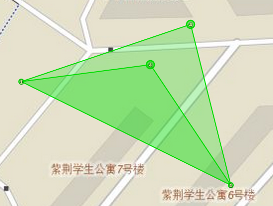

在intel map上可以很明显的看出，被多层field覆盖的区域颜色更深。图中颜色较深的地区就被一大一小两个三角形field覆盖。再举个例子，如下：

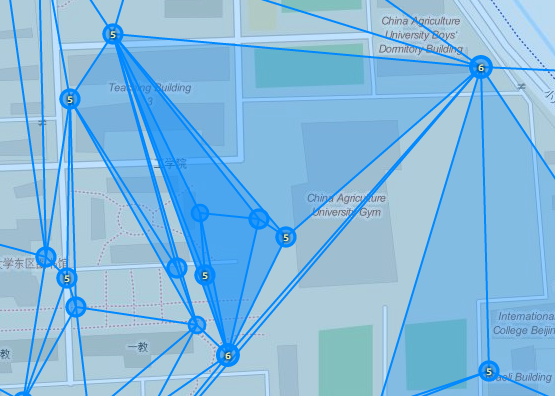

可以明显的看出颜色的深浅，field层数越多颜色越深。上图颜色最深的部分还展示了一种经典的最大化field数的布局，后文会详细说明。

下面我们将说明，如何利用这一特性，来最大化field数。

###Building blocks: 4点多重布局###

对于“三角形+内点”的portal布局，我们可以连线成如下图的样子：

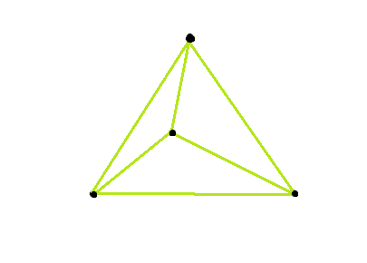

问：上图中有多少个三角形？小学奥数告诉你：4个。

那么实际游戏中，会不会真的获得4个field？答案是肯定的。Ingress是允许大field覆盖在小field上的。但Ingress还有以下两条规则：

1. field内的点不能向外连线（但field边界上的点可以向内）
2. 对于一条新建立的link，在其左右两边分别寻找**一个**面积最大的control field，作为该link形成的field。也就是说，一条link至多形成2个field，左右两边各一个。

也就是说，如果你先连成这个样子：

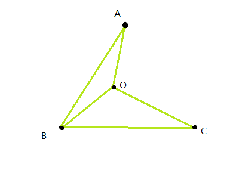

然后再连上AC，那么AC这条边只会增加1个field，即ABC，而小三角形AOC是判定不出来的。这样就只有3个field，而不是4个。

那么，要如何才能判定出4个三角形呢？先说结论：

先做出一大一小两个三角形，如图：

再从顶点往内点连线：

根据规则，第二步是可以判断出两个field的，因为不在同一侧。然后我们就有了4个field！由于这一个连线动作能产生1250+1250+375=2875 AP，这一步骤在清华绿军中有一个外号叫“爽歪歪”。

另外，第一步中先做大后做小，还是先做小后做大，只要正确的判定出两个三角形，都是不影响结果的。但我们一般先做小后做大，这是因为，field内部的点不能向外连线，如果先做了大三角形ABC，此时处于field中的O点就不能向外连线，在后文要讲述的复杂多重中，有时要在ABO内部构造多重，如果先把ABC连上了，那么无论如何ABO内部的多重也做不出来了。

###3m + n - 2###

我们知道，对于每一个“三角形+内点”布局，都可以通过特定的连线方式构建出4个三角形。现在，我们找到了一片密集的po，在最外边的n个po围成的凸多边形内部含有m个点，那么我们最多能构建出多少field呢？

可以证明，是3m+n-2。最优方案构造方法如下：

将凸n边形用对角线划分成三角形。能够划分成n-2个。

然后，每次选择一个内点，找到包含它所的最小三角形，将该内点与三角形三个顶点分别连线。这样每次都能够增加3个三角形。m个内点总共能增加3m个。

因此总共能形成3m+n-2个三角形。可以证明这是最优的。

###以小见大###

看完上述证明，一定会有人问：这个构造方法的确能构造出3m+n-2个“三角形”，但在Ingress的规则下能建立这么多field么？n=3, m=1的情况都需要学习正确的姿势，n和m更多的情况呢？

的确，如何正确的建造出这么多field，一直是一个难点，也是本文的重点。

先复习一下n=3, m=1的姿势：1. 一小一大（实线），2. 爽歪歪（虚线）

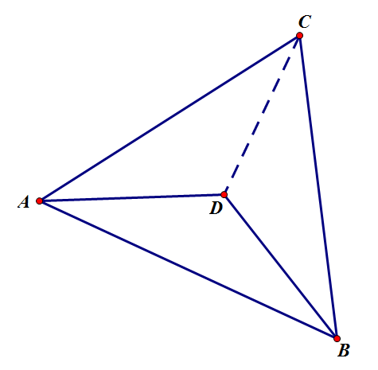

现在我们增加一个内点，即n=3, m=2。根据3m+n-2构造法，设第一个加入的点位D，第二个加入的点为E。

为了更加方便描述，我们引入几个专有名词（清华绿军原创）：

* **底边**：“一大一小”步骤中建立的两个三角形的公共边。如AB
* **顶点**：大三角形中与底边相对的点，也是“爽歪歪”时玩家所在位置。如C
* **第一分割点**：3m+n-2构造过程中第一个加入的内点。如上图中的D
* **底边三角形**：底边与第一分割点形成的三角形，也是“一大一小”中建立的小三角形。如ABD

根据第一分割点所划分出的三个区域，可以把E的位置分为三种情况。容易发现ACD和BCD两个区域是对称的，因此只需考虑两种情况：E在底边三角形内，E不在底边三角形内。

如E在底边三角形内，则根据3m+n-2

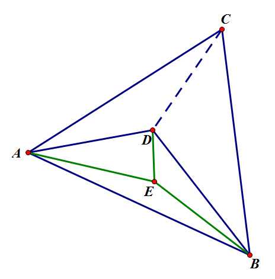

如何让E的加入增加3个field，也就是ABD区域内总共有4个field呢？学过递归的人应该会觉得很容易：ABD区域不就是n=3, m=1么，“一大一小”中不是需要建立这个完整的小三角形么，顺便用正确姿势建立出这4个field就行了。

比如，我们可以这样：一小一大（绿实线），爽歪歪（绿虚线），一小一大（蓝实线），爽歪歪（蓝虚线）

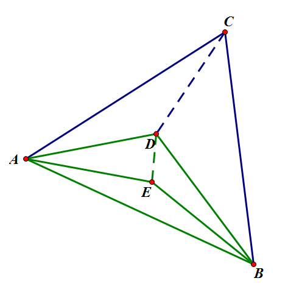

比如，我们还可以这样：反正是变成一个完整的底边三角形，没必要跟人家选一样的底边嘛。

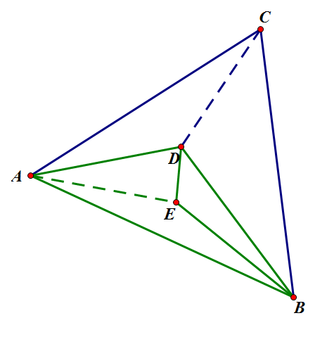

看不懂上一句话的可以仔细在脑中模拟一下连线-判定的过程。利用底边三角形的完整性，不断的换底边是有好处的。之后会提到。当然，第一种做法也有优势，其中之一就是比较无脑，因为它给人一种“不断的找点吃掉这个三角形，让底边三角形慢慢增长”的感觉，这种易于理解的性质在现场规划的多重中非常有用。

E在底边三角形内的情况讨论完毕。接下来讨论E不在底边三角形内的情况。由对称性，不妨设E在ACD内。

则根据3m+n-2

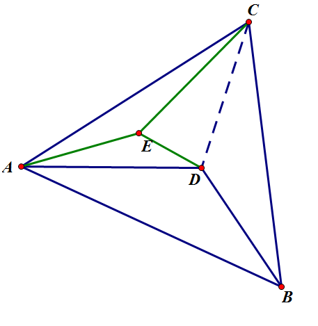

三角形ACD区域不就是n=3, m=1的情况么！什么时候判定ACD为field的时候顺便把多重做出来不就行了么！不过这里有那么一点tricky……

什么时候会形成ACD？是在“爽歪歪”连接CD的时候。这是ACD的“一大”已经形成，然后可以跑到A点或者D点去往里面那个E连——不，D在大field里——于是似乎只能以AC为底边……构出“一小”ACE，然后去顶点D“爽歪歪”——不，D在大field里……

所以，只能先构“一小”，再连接CD，并且只能以AD为底边，因为CD是最后连的，AC所对的顶点是大field里的D。而且大field ABC一旦形成，DE两点都连不出link来了，所以DE一定要在ABC形成之前连起来。至于底边三角形的另一条边AE，好吧你要是愿意先跑到C再跑回A再跑回C而不是站定在C一次爽歪歪个够，那我也不阻止你，反正AP是一样的（其实更重要的原因是这种做法似乎不具有可推广性……）。

于是我们发现，在“一大一小”过程中，我们需要插入一个步骤：把左边那个底边三角形ADE构建出来。为了描述方便，我们再引入一个专有名词：

* **旁接三角形**：在最大的底边三角形之外，以底边三角形的左右斜边为底边的那个底边三角形（我不是故意写这么拗口的），必须在爽歪歪之前构建好的小三角形。如ADE。

步骤描述如下：“一小”底边三角形ABD，“一小”旁接三角形ADE，“一大”三角形ABC，“爽歪歪+一大”连接CD，“爽歪歪”连接CE。

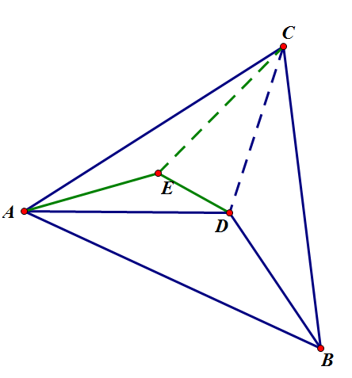

注意，CD和CE的连接顺序千万不能反！否则，连CE时出ACE，连CD时出ACD和ABD，CDE这个field就没有了！这就是我们专门把D叫做“第一分割点”的主要动机，一定要先连第一分割点，再连第二分割点。

n=3, m=2的情况解决。接下来讨论n=3, m=3的情况……现在三角形ABC被划分成了5个区域，是不是要分5种情况？稍加思考，可以发现，其实还是规约于两种情况：在底边三角形里和不在底边三角形里。

比如，如果新加入的点F在旁接三角形ADE内，那么在构建完整三角形时，把ADE区域当成n=3, m=1的情况来做即可。在ABD内同理。

如果F在CDE内，那么在旁接三角形ADE构建完成之后构建旁接三角形DEF，然后构出ABC，依次连接CD, CE, CF，注意顺序！

ABD, BCD, ACE的情况与之前几种情况相似，留做作业。

###分而治之###

当我们面对一个复杂而无从下手的任务时，我们应该尝试把它分解为较为简单的步骤。

学计算机的知道，当我们面对一个复杂的问题时，我们可以尝试把它分解为相似的子问题，解决了子问题，再把子问题的结果合并起来，形成最终方案。

当我们面对n>3的情况时，我们可以先在脑海中把这个多边形划分成n-2个三角形区域，然后按照n=3的情况依次构建。

当我们面对n=3，m很大的情况时，我们可以这样：

1. 选择底边，记为AB，对应顶点记为C
2. 选择第一分割点，记为O
3. 构造底边三角形ABO及所有其内部结构
4. 构造CAO内旁接三角形，以及所有间接旁接三角形，含内部结构
5. 构造CBO内旁接三角形，以及所有间接旁接三角形，含内部结构
6. 构建最大field ABC
6. 连接顶点C和第一分割点O
7. 完成顶点与CAO内旁接三角形的连接
8. 完成顶点与CBO内旁接三角形的连接

如果上面对于n=3, m=2的的讨论以及m=3的作业让你对于3m+n-2系列从小到大的构建步骤构建有了一定的认识，那么上面9个步骤就是从大到小的宏观概念。这9个步骤中，有一些并不是那么直观到能够直接付出行动的程度，如“构造底边三角形及其所有内部结构”。这就是递归的概念：底边三角形ABO的构建，和整个多重方案的构建，大致是相同的事情，只要把ABO当作是ABC，把工作范围限制到ABO内，就是相似的问题，并且在一定程度上简单一些——n依然是3，m变小了。对这个新的ABC依次执行这9个步骤，其中依然会碰到“构造底边三角形”这样不简单的事情，此时把工作范围再次缩小限定，对这个新的、小一些的三角形执行9个步骤。如此下去，把三角形限制的越来越小，m越来越小，直至变成我们学过的情况：m=1，甚至m=0。完成这个最基本的任务之后，再把分解的过程反过来，一步一步扩大工作范围，把之前完成的底边三角形当作一个整体而不去管其内部细节，如此继续执行后续步骤，直到工作范围扩大到最大的三角形，完成整个方案为止。

刚才的讲述依然是这个递归过程的具体执行过程——对于没有接触过递归的人来说，我希望这能够有助于理解。

还有一种宏观一些的理解方式，类似数学归纳法：如果我们能解决作为一个整体的底边三角形，以及旁接三角形等，我们就能把他们组合起来，多连一些线，形成完整方案。事实上我们也确实能——我们能直接做出m=0和m=1的情况，因此我们能把它们组合起来多连一些线，形成m=2, 3, 4的方案，我们还能再次组合，形成m=5, 6, 7, …，以此类推。

很多时候，理解一个较为抽象的概念或者过程的最好的方式是找一个具体例子。但我个人认为，对于递归这个概念，找个例子一步一步执行，似乎是无济于事的。不过，考虑到我们并不是写程序，并不是定义一个函数然后在里面调用一下自己就了事了的，Ingress这个游戏要求我们亲自去一条一条线的连link，我还是来举个例子讲解一下。

清华大学紫荆学生公寓，虽然po密度不及清华其他两个著名farm场主楼小树林和紫荆雕塑园，但以其鲜明的地理位置优势，经常成为清华玩家集体活动的起塔地区，以及带新人时的建field刷AP常用地区之一。

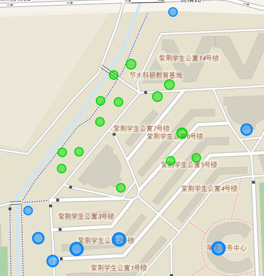

于是我们准备在这里练习最大field数的建立。首先，第一步当然是把这些塔都占下来插满脚。

对着地图，分出外点和内点。

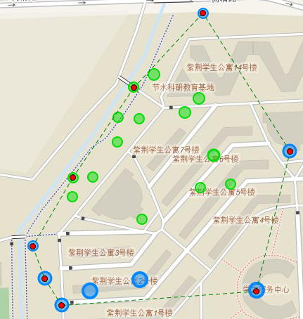

n=8, m=14.

画一些对角线，形成n-2=6个三角形区域

